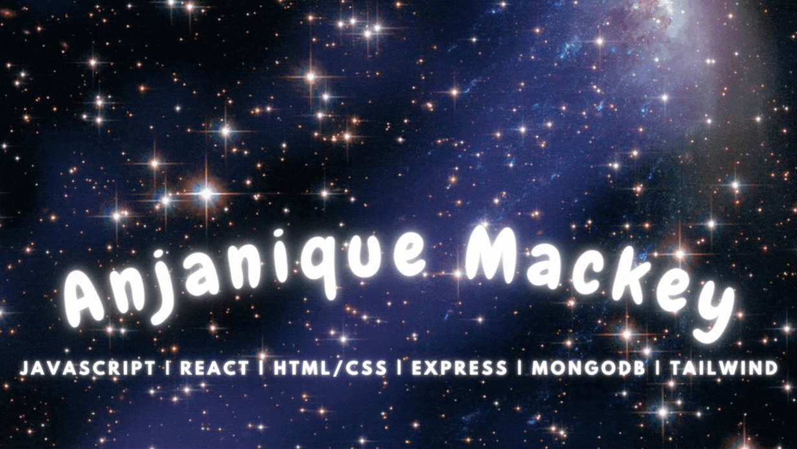
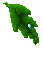
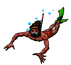

<!--  -->

  
    

 

 
 <!--  -->

  Technologies I have learned (in reverse order!)
  
  

  
  <!--https://devicon.dev/-->

  
            
  
          
  
          
  

         
  
  
          
  
  
 

  
          
  
          
  

  
          
  
  

   
   
   
  
<!-- 
&nbsp;
 -->
                                                                                                                                                                        

 
 ###  "Difficult does not mean impossible!" 
<!--Christmas gifs-->
<!--

-->

          
<!-- 
- [] add my favorite projects/links that i want people to checkout

-->
